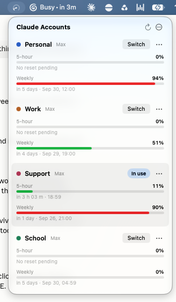

# ClaudeAccounts

**Switch Claude accounts without losing your chats.**

[](https://github.com/RohanNaga/ClaudeAccounts/releases/latest)
[](https://github.com/RohanNaga/ClaudeAccounts/releases/latest)
[](https://github.com/RohanNaga/homebrew-tap)
[](LICENSE)

A macOS menu bar app for people with more than one Claude account, like a work
plan, a school plan and a personal one. It shows the 5-hour and weekly usage of
every account at once. One click switches the Claude desktop app to another
account, and your open Claude Code chats come with you: same history, same
worktrees.

<p align="center">
  
</p>

> ClaudeAccounts is an independent project. It is not made, endorsed or
> supported by Anthropic. Claude is a trademark of Anthropic. Use each account
> under Anthropic's terms for that account.

## Why

The Claude desktop app holds one account at a time. Signing out and back in as
another account works, but your open Claude Code chats stay behind with the old
account. ClaudeAccounts swaps the account for you and carries the chats over, and
its menu shows at a glance which account has room left.

## Install

```bash
brew install --cask rohannaga/tap/claudeaccounts
```

Or download `ClaudeAccounts-<version>.zip` from the
[latest release](https://github.com/RohanNaga/ClaudeAccounts/releases/latest),
unzip it, and move **Claude Accounts** to Applications.

You also need the Claude desktop app, and Claude Code installed at
`~/.local/bin/claude` (the app uses it to sign in to each account). The app runs
on macOS 15 or later, on Apple Silicon and Intel. It was tested with Claude
desktop 2.9939.2 on macOS 27.

### First launch

The app isn't notarized by Apple, so macOS stops the first launch with "Apple
could not verify Claude Accounts is free of malware". Open **System Settings ›
Privacy & Security**, scroll down, and click **Open Anyway**. If you'd rather
use Terminal:

```bash
xattr -dr com.apple.quarantine "/Applications/Claude Accounts.app"
```

## Getting started

1. Click the gauge in the menu bar, then **Add Account…**. Your browser opens
   Claude's sign-in page; paste the code it shows back into the app. Repeat for
   each account.
2. For every account other than the one Claude is signed in to, click
   **Set Up**. Claude reopens at its sign-in page; sign in as that account. This
   saves the account's Claude login without signing the others out.
3. From then on, **Switch** on any row moves Claude, and your open chats, to
   that account.

## Read this before you switch

Switching works by editing the Claude desktop app's own files while it is quit:
its cookie database, its settings file and its chat records. None of that is a
public interface, and an update to Claude can change it. The app is built to
fail closed. It backs everything up first, refuses to act when something looks
off, and undoes a switch that Claude doesn't confirm. Still, use it at your own
risk, and keep the backups in the app's `backups` folder until you trust it on
your setup.

## What it touches

| Where | What | When |
|---|---|---|
| `~/Library/Application Support/ClaudeAccounts` | Everything the app keeps: accounts, per-account Claude Code logins, saved Claude logins, backups, settings, the usage cache | Always |
| Login keychain | One `Claude Code-credentials-<hash>` item per account, written by Claude Code | Adding or signing in to an account |
| `api.anthropic.com/api/oauth/usage` | Each account's usage, about once a minute | Always; this is the only network traffic |
| `~/Library/Application Support/Claude` | The claude.ai cookie rows, three keys in `config.json`, and chat records in `claude-code-sessions` | Only on **Switch** or **Set Up**, with Claude quit |
| `~/Library/Logs/Claude/main.log` | Read only, to see which account Claude reports | Always |

**Remove** on an account's `···` menu signs its login out and deletes its
keychain item. To uninstall, remove your accounts, quit the app, and delete it
and the `~/Library/Application Support/ClaudeAccounts` folder.

## How switching works

**Switch** on a row signs the Claude desktop app in as that account and brings
your open Code sessions along:

1. It asks Claude to quit the way ⌘Q does and waits until Claude's process is
   gone. If a chat is mid-reply Claude asks first; answering Cancel ends the
   switch at once with nothing changed.
2. It backs up Claude's `Cookies` and `config.json` and writes a journal before
   changing anything.
3. It saves the current account's login (its claude.ai cookie rows and three
   settings keys), but only if Claude's log and settings agree on who that
   account is.
4. It loads the target account's saved login.
5. It moves each open session's record (not archived, not a scheduled run) from
   `claude-code-sessions/<account>/<org>` to the target's folder. The session
   id, transcript, worktree and lease stay the same. If the target already has a
   copy, the newer one wins and the older one goes to the backup's `quarantine`.
6. It reopens Claude. The switch counts only when Claude's log reports the
   target account and organization. A sign-out, another account, or no answer
   within a minute undoes every step from the journal.

The account shown as **In use** is the one Claude's own log reports: the line
Claude writes each time it loads an account's chats, naming the account and its
organization. Each switch leaves a folder in `backups` with the files from before
it and `switch.json` listing what moved; the last ten are kept.

From a terminal outside Claude, `ClaudeAccounts --status` prints what a switch
would act on, and `ClaudeAccounts --switch <name>` runs one. The binary is at
`Claude Accounts.app/Contents/MacOS/ClaudeAccounts`.

## Usage and sign-in

- About once a minute the app reads each account's usage from the same endpoint
  and at the same pace as the Claude app's own reader. Asking faster earns HTTP
  429 with a multi-minute `Retry-After`; when that happens the row keeps its
  last numbers, notes when it will retry, and waits exactly that long.
- Access tokens last about 8 hours. When one is close to expiry the app runs
  `claude -p /usage --no-session-persistence` for that account, and Claude Code
  renews the login itself. This spends no model usage.
- Each login has a fixed deadline about four weeks out that renewals don't
  extend. A day before it, the row shows **Sign in again** and the menu bar icon
  turns into a warning.
- Each row's `···` menu can **Rename** an account and pick its **Color**. The
  header's `···` menu sets what the menu bar shows and whether the gauge follows
  the 5-hour or the weekly limit. **Open at Login** registers the app in System
  Settings › Login Items.

## Limits

- A `claude setup-token` token can't read usage, because it lacks the
  `user:profile` scope. That's why the app uses full logins.
- Switching depends on Claude's cookie schema (version 24), its session-record
  layout, and one log line. If an update changes them, a switch fails closed: it
  is refused or undone rather than half-applied.
- Archived sessions and scheduled-task runs stay with the account they belong to.
- A chat that was running in bypass-permissions mode may come back in a safer
  mode after the restart; Claude re-launches it without the bypass flag.

## Build from source

```bash
git clone https://github.com/RohanNaga/ClaudeAccounts.git
cd ClaudeAccounts
./build.sh
open "Claude Accounts.app"
```

It needs the Xcode Command Line Tools (`xcode-select --install`). `build.sh`
compiles one binary for Apple Silicon and Intel with `swiftc`; `release.sh`
builds and zips it into `dist/` for a GitHub release and prints the checksum the
Homebrew cask needs. The icon is drawn by `app/make-icon.swift`; delete
`app/AppIcon.icns` to regenerate it. Before 0.3 the app kept its state in a
`data` folder beside itself; the first launch of 0.3 moves it to Application
Support and carries each login's keychain item over.

## License

MIT. See [LICENSE](LICENSE).
